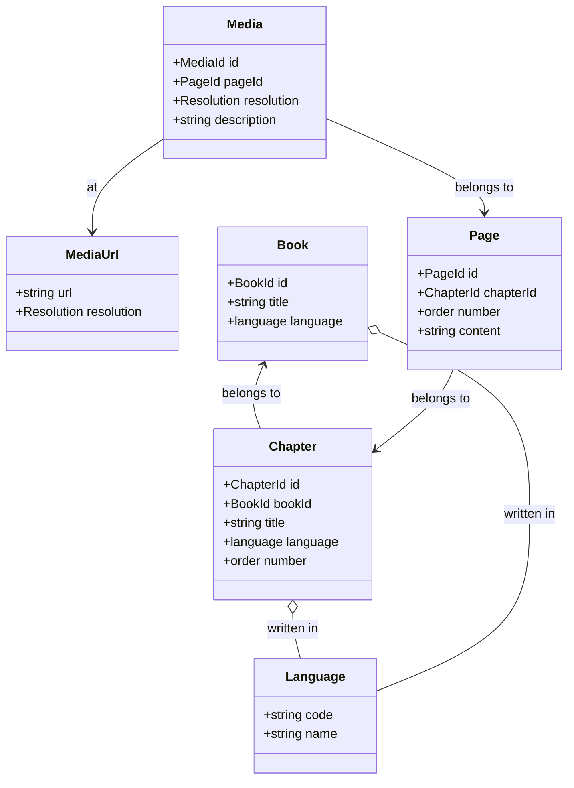

# Models

# Value Objects

`Language` - is a value object to determine the language of a `Book` or `Chapter`. `Language` has a `code` fied which is a two letter code of the language. For example `en` for English, `de` for German, `fr` for French, etc.
